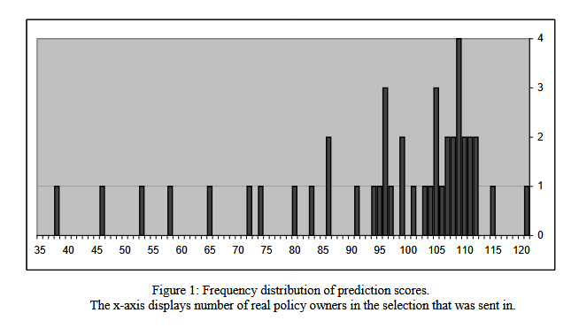

# Caravan Insurance Prediction (CoIL Challenge 2000)

Ce projet vise à identifier les clients les plus susceptibles de souscrire à une assurance **CARAVAN**. 

## Objectif 
Sélectionner les **800 clients** ayant la plus forte probabilité d'avoir l'attribut **CARAVAN = 1**, en maximisant le nombre de vrais positifs dans un *top-k*.

## Résultat 
Modèle utilisé : régression logistique

$$\text{Top-} 800 = 115$$

Ce score est comparable à celui ayant terminé 2e au classement public de la compétition (Top-800 = 115). Le meilleur score étant de 121.

Cette comparaison est fournie à titre informatif et n'est pas un classement officiel.

  <h4>Résultats du classement public de la compétition</h4>
  

## Description des modules du projet
### **Trackers/feature_tracker.py** 
  Regroupe l'ensemble des outils permettant de **définir, créer, suivre, retirer, supprimer et tester** les features utilisées par le modèle. Ce module centralise le feature engineering en assurant une gestion simple, rapide et efficace de tout type de variables, tout en facilitant l'analyse de leur impact sur les prédictions du modèle.

### **FeatureTools.py** 
  Regroupe l'ensemble des outils d'analyse et d'ingénierie des variables utilisés tout au long du projet. Ce module fournit des méthodes pour évaluer l'importance des features dont la **Matrice de Fisher Information, VIF et corrélation entre paires**.\
  Des outils de diagnostic/déboguage sont aussi disponible, dont :
  - l’analyse des variables présentant une variance négative et/ou gigantesque
  - l’identification des colonnes constantes ou rares
    
  Il inclut également des fonctions d'interprétation notamment :
  - les odds ratios avec intervalle de confiance
  - l’analyse des contributions des variables
  - les profils moyens par groupe 
  - plusieurs outils facilitant l’analyse comparative entre TN / FP / FN / TP
    
### **logisticRegression.py** 
  Contient l'implémentation complète d'une régression logistique from scratch. Ce module définit les fonctions fondamentales du modèle, incluant la fonction sigmoïde, la fonction de coût et l'optimisation par descente de gradient.

  De plus, cette implémentation contient plusieurs paramètres optionnels dont
  - Régularisation L2 et L1
  - Pondération des classes
  - Mécanisme d'early stopping

  Ce module fournit aussi un utilitaire pour optimiser le paramètre de régularisation λ

### **plot_tools_extra.r** 
  Ce module contient la fonction **plot_catpca()**. Elle réalise une CATPCA à l'aide de `princals` du package **Gifi**. La fonction **plot_catpca()** est mieux adapter aux variables catégorielles ordinales.

### **plot_tools.py** 
  Ce module regroupe l’ensemble des outils de visualisation d'analyse et de diagnostic des hyperparamètres du modèle. Il fournit des fonctions pour étudier **l’impact des class weights, des learning rates et des seuils de décision** sur les métriques. \
  Il inclut également des outils graphiques pour analyser la convergence du modèle, comparer les performances train/validation, explorer les distributions des variables par groupes (TN / FP / FN / TP) et projeter les données via **PCA** et **LDA**.
  
### **Model.py** 
  Définit une classe `Model` qui encapsule un modèle de régression logistique entraîné, ainsi que l'ensemble des méthodes nécessaires à son évaluation et à son analyse.
  
  Ce module gère la prédiction des probabilités, l’application de seuils, le calcul de matrices de confusion et permet l’évaluation basée sur plusieurs type de métriques.
  
  Il inclut également des outils pour comparer les performances sur les jeux d’entraînement et de validation, ainsi que plusieurs fonctions utilitaires pour la gestion des paramètres du modèle et son évaluation.
  
  Ce module inclut aussi la fonction create_model qui centralise l’entraînement du modèle et l’instanciation de l’objet Model.

### **data.py**
  Ce module gère l’ensemble du chargement, du prétraitement et de la gestion des métadonnées des données du projet. Il centralise la lecture des jeux de données (train, validation et évaluation) et la standardisation des variables numériques via un singleton de DataInfo.
  
  Il fournit également des utilitaires pour la traduction des variables à partir de leurs dictionnaires afin de faciliter leur lecture, ainsi qu’un utilitaire dédié à la préparation des données pour la CATPCA.
  
